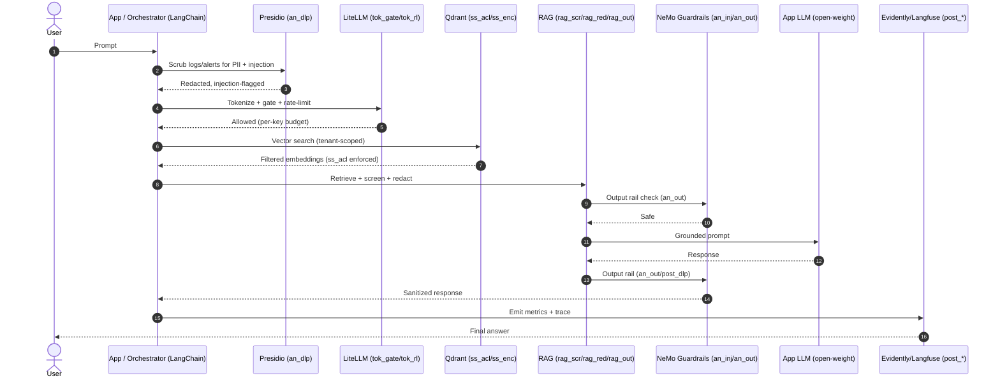
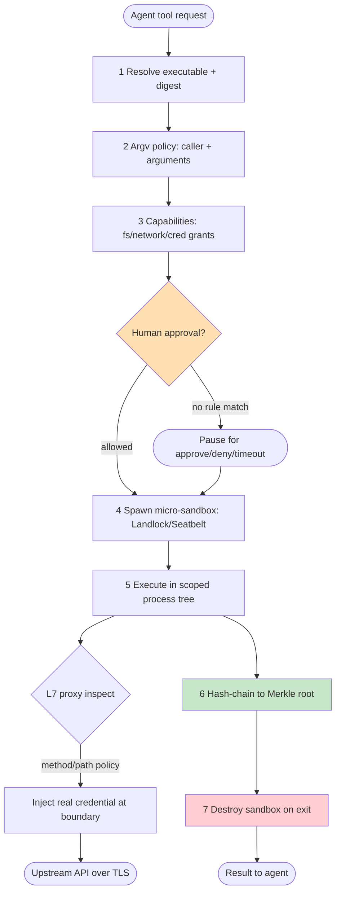
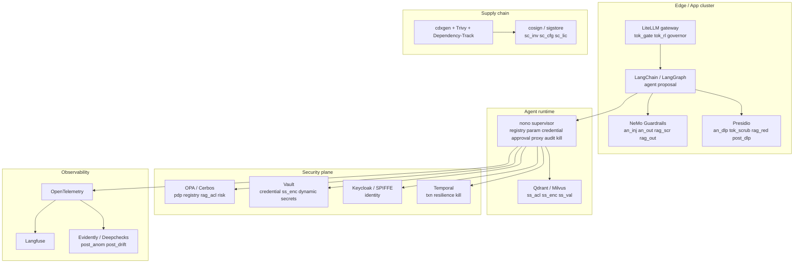

# OSS-Only Reference Architecture — `llm-c4-controls`

A concrete, **open-source-only** implementation of the 41 control components defined in this repo's
two Level-3 C4 diagrams (`04-data-exposure-controls.puml`, `05-agent-tool-runtime-controls.puml`).
Every tool named here is OSS and self-hostable. Where a control has **no** OSS tool (e.g. `post_emb`,
`sc_train` poisoning), that is called out as a build item rather than papered over.

> Companion to [`CANDIDATE_APPS.md`](CANDIDATE_APPS.md) (which also lists commercial options) and the
> PlantUML C4 sources. Diagrams below are Mermaid (GitHub-native) and complement those `.puml` views.
> Validation: all Mermaid blocks in this file render under `@mermaid-js/mermaid-cli` v11.

## Design principles (OSS constraints)

1. **Separate-instance inspector.** `an_dlp` and `post_dlp` run on a DLP/inspector model *disjoint*
   from the app LLM (Presidio or open-weight Llama Guard, not a SaaS API that re-introduces egress).
2. **Enforcement spine = one tool.** `registry`+`param`+`credential`+`approval`+`proxy`+`audit`+partial
   `kill` are absorbed by **nono** (kernel-enforced agent sandbox) — one OSS binary, not five services.
3. **Repurpose hardened infra.** Identity, ABAC, dynamic secrets, transaction/resilience, and
   egress are mature OSS (Keycloak, OPA, Vault, Temporal, Envoy) — wire them, don't rebuild them.
4. **Tamper-evident audit.** nono's Merkle-rooted trail + OpenTelemetry/Langfuse for the rest.
5. **No telemetry to third parties.** All components run in your boundary; model weights are
   open (Llama/Mistral/etc.) or your own hosted endpoint.

## Component map — controls to OSS tools

```mermaid
flowchart LR
  subgraph A[04 Private-Data Exposure]
    A1[AI Analyzer<br/>an_dlp an_rbac an_inj an_out]
    A2[Tokenizer/Diagnostics<br/>tok_scrub tok_gate tok_rl]
    A3[Semantic Search<br/>ss_enc ss_acl ss_val]
    A4[RAG<br/>rag_acl rag_scr rag_red rag_out]
    A5[Supply Chain<br/>sc_inv sc_sbom sc_train sc_cfg sc_lic]
    A6[Post-Usage<br/>post_dlp post_emb post_anom post_drift post_alert post_rt]
    end

    subgraph B[05 Agent Tool / Runtime]
      B1[agent proposal registry identity param pdp]
      B2[risk approval credential txn proxy]
      B3[result governor resilience audit kill]
    end
  end

  A1 --> PRES(Presidio + NeMo Guardrails + OPA)
  A2 --> LIT(LiteLLM gateway + vLLM)
  A3 --> VEC(Qdrant/Milvus + Vault Transmit)
  A4 --> RC(LangChain/LlamaIndex + OPA + Presidio + NeMo)
  A5 --> SC(cdxgen + Trivy + Dependency-Track + cosign + Cleanlab)
  A6 --> PU(Evidently + Langfuse + Presidio-inspector)

  B1 --> NONO1[nono + Keycloak + OPA]
  B2 --> NONO2[nono + Vault + Temporal]
  B3 --> NONO3[nono + GuardrailsAI + LiteLLM + Temporal]

  OT[OpenTelemetry collector] -.-> A6
  OT -.-> B3
  LANGFUSE[Langfuse] -.-> A6
  LANGFUSE -.-> B3
```

## Request / data-exposure flow (a single query)

Shows the `04` path a user prompt takes, and which OSS tool enforces each hop.



## Agent tool-execution loop (`05`) — nono in the middle

The enforcement spine. Every tool call is brokered by nono; the app LLM never touches a real
credential or an unsandboxed process.

```mermaid
sequenceDiagram
  autonumber
  participant LLM as Agent LLM
  participant Plan as LangGraph (agent/proposal)
  participant SUP as nono supervisor
  participant POL as OPA (pdp/registry/rag_acl/risk)
  participant SBX as nono micro-sandbox
  participant PRX as nono L7 proxy
  participant TOOL as External tool / API
  participant VLT as Vault (credential)
  participant HUM as Human (approval)
  participant AUD as nono Merkle audit + OTel

  LLM->>Plan: Propose action + tool call
  Plan->>SUP: Tool invocation request
  SUP->>POL: Evaluate argv + caller + risk
  alt Out-of-policy
    POL-->>HUM: Request approval
    HUM-->>POL: Approve / Deny
  end
  SUP->>VLT: Resolve phantom credential
  VLT-->>SUP: Real secret (stays with supervisor)
  SUP->>SBX: Spawn invocation-scoped sandbox
  SBX->>PRX: Tool call (phantom token)
  PRX->>PRX: Inject real credential at boundary
  PRX->>TOOL: Forward (method/path policy)
  TOOL-->>PRX: Result
  PRX-->>SBX: Result across supervisor boundary
  SBX-->>SUP: Output (validated by GuardrailsAI)
  SUP->>AUD: Hash-chain event (Merkle root)
  SUP->>LLM: Sandbox destroyed; result returned
  note over SUP,SBX: kill switch = Vault revoke + Temporal cancel + sandbox destroy
```

## Enforcement-spine detail (nono)

Why nono collapses 7 controls into one binary. Request → resolve → authorize → spawn → execute →
audit → destroy.



## Deployment topology

Where the components physically run. All in your boundary; no external SaaS.



## Consolidated OSS control → tool mapping

Verdict legend: **F**=Full(repurpose) · **C**=Composite · **B**=Build. "Enforcement spine" = nono.

| # | Control | OSS tool(s) | V |
|---|---|---|---|
| 1 | `an_dlp` | Presidio (separate-instance) | F* |
| 2 | `an_rbac` | OPA / Keycloak | F |
| 3 | `an_inj` | NeMo Guardrails input rail / Presidio | C |
| 4 | `an_out` | NeMo Guardrails output rail | C |
| 5 | `tok_scrub` | Presidio | F |
| 6 | `tok_gate` | LiteLLM gateway | F |
| 7 | `tok_rl` | vLLM per-key logprob suppress / LiteLLM | C |
| 8 | `ss_enc` | Vault Transit / KMS | F |
| 9 | `ss_acl` | Qdrant/Milvus payload ACLs | F |
| 10 | `ss_val` | nono (index validation) / garak | C |
| 11 | `rag_acl` | OPA policy on retrieval | C |
| 12 | `rag_scr` | NeMo retrieval rail | C |
| 13 | `rag_red` | Presidio redaction | F |
| 14 | `rag_out` | NeMo output rail | C |
| 15 | `sc_inv` | cosign / sigstore | F |
| 16 | `sc_sbom` | cdxgen (ML-BOM) | F |
| 17 | `sc_train` | Cleanlab (adjacent only) | **B** |
| 18 | `sc_cfg` | OPA / cosign | C |
| 19 | `sc_lic` | OSS Review Toolkit / ScanCode | F |
| 20 | `post_dlp` | Presidio (separate-instance inspector) | F* |
| 21 | `post_emb` | — (must build; CSPM + VDB audit-log only) | **B** |
| 22 | `post_anom` | Evidently / Langfuse | F |
| 23 | `post_drift` | Evidently / Deepchecks | F |
| 24 | `post_alert` | OpenTelemetry → SIEM/Alertmanager | C |
| 25 | `post_rt` | Langfuse real-time traces | C |
| 26 | `agent` | LangGraph / AutoGen (planner/executor split) | C |
| 27 | `proposal` | LangGraph proposal object | C |
| 28 | `registry` | **nono** signed profiles + OPA | C |
| 29 | `identity` | Keycloak / SPIFFE-SPIRE | F |
| 30 | `param` | **nono** argv policy + Pydantic | C |
| 31 | `pdp` | OPA / Cerbos | F |
| 32 | `risk` | OPA rules + custom LLM-judge | C |
| 33 | `approval` | **nono** inline HITL + HumanLayer | C |
| 34 | `credential` | **nono** phantom-token + Vault | F |
| 35 | `txn` | Temporal | C |
| 36 | `proxy` | **nono** kernel sandbox + Envoy | C |
| 37 | `result` | **nono** trusted boundary + GuardrailsAI | C |
| 38 | `governor` | LiteLLM budgets + LangGraph limits | C |
| 39 | `resilience` | Temporal + Tenacity | F |
| 40 | `audit` | **nono** Merkle + OpenTelemetry/Langfuse | C |
| 41 | `kill` | **nono** sandbox-destroy + Vault revoke + Temporal cancel | C |

`F*` = Full **only** when the inspector runs as a *separate* model instance (the repo's load-bearing rule).

## What this stack does NOT cover (honest gaps)

- **`post_emb`** — no OSS detector for embedding-exposure in transit/at-rest. Build: monitor VDB
  access logs + CSPM; deep inspection remains custom.
- **`sc_train` poisoning** — no production OSS tool; Cleanlab is adjacent (data-quality), not a
  poison-specific detector. Research-stage.
- **`risk` semantic classification** — OPA covers static rules; the *semantic* risk of an action
  needs a custom LLM-judge you own and evaluate.
- **`agent` planner/executor split** — nono enforces the *tool-execution* half; the architecture
  decision (separate planner from executor) is yours to make in code.

## Minimum-viable OSS deployment

If you stand up only four things, stand up these — they cover the highest-leverage controls:

1. **nono** — enforcement spine (`registry`/`param`/`credential`/`approval`/`proxy`/`audit`/`kill`).
2. **Presidio** (self-hosted) — `an_dlp`/`tok_scrub`/`rag_red`/`post_dlp` as a separate-instance inspector.
3. **LiteLLM gateway** — `tok_gate`/`tok_rl`/`governor` (rate/cost/step budgets).
4. **OPA + Vault + Temporal** — `pdp`/`identity`/`credential`/`txn`/`resilience`.

Add NeMo Guardrails + Qdrant + OpenTelemetry/Langfuse for the content rails, vector ACLs, and
observability. The supply-chain layer (`sc_*`) is independent and can follow later.
