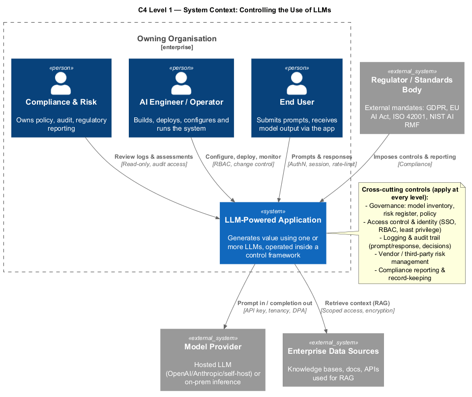
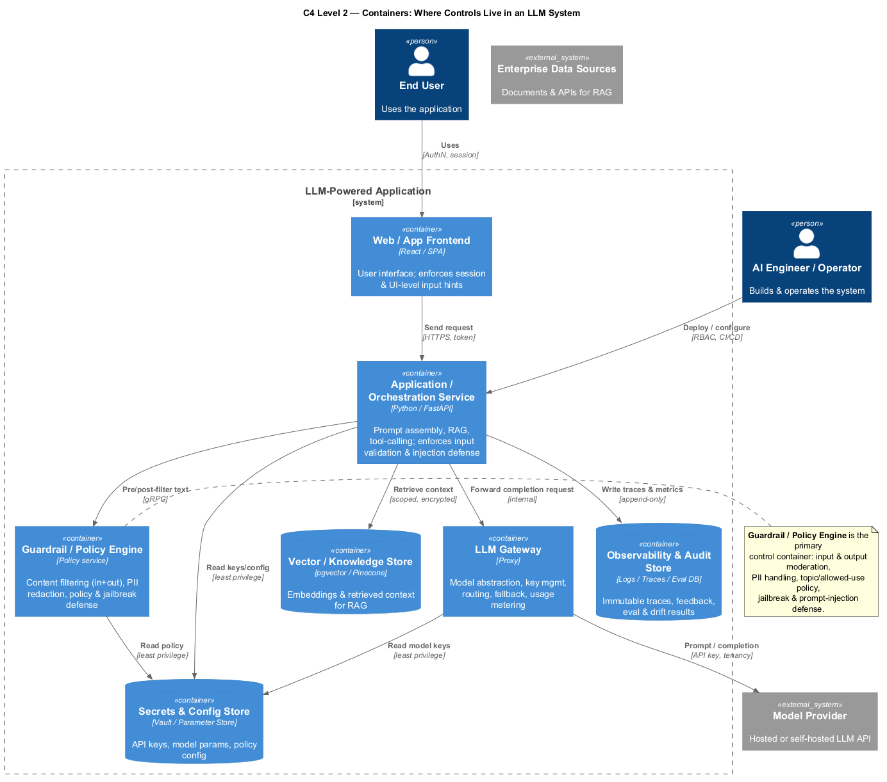
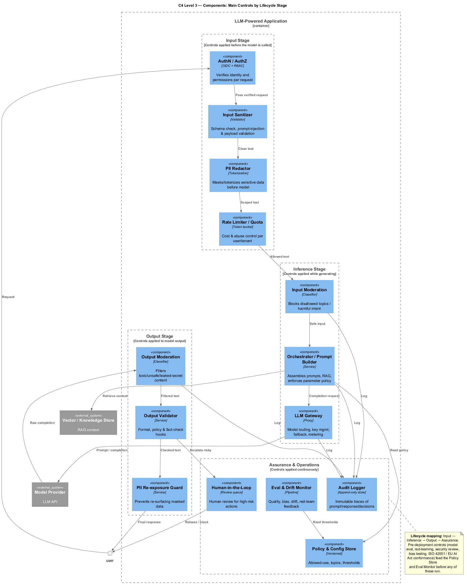
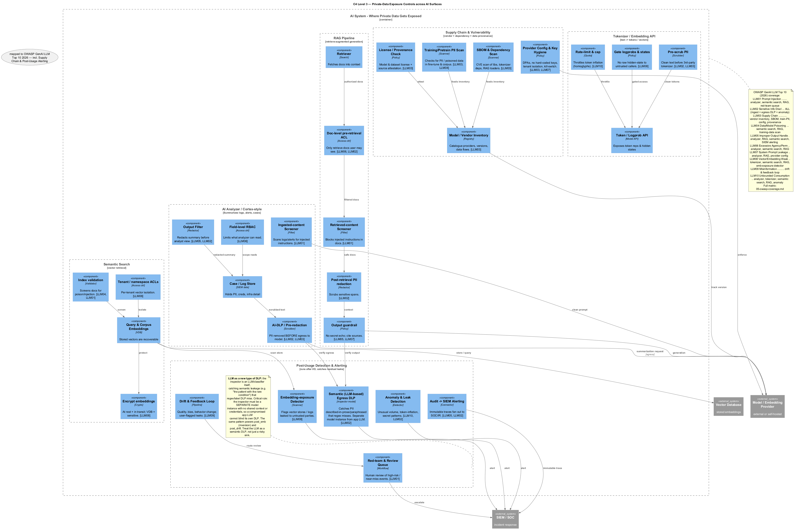
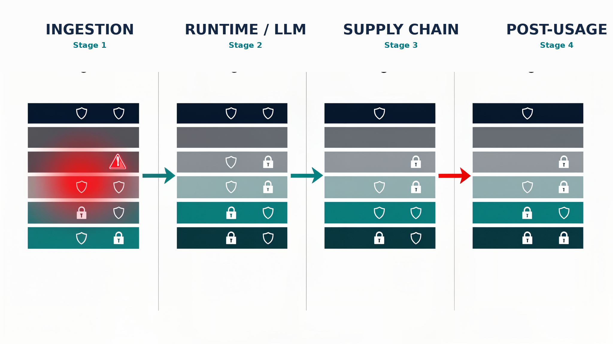

# Architecture — C4 Controls for Private-Data Exposure in AI Systems

This page explains the C4 model used in this repo and how the diagrams map onto the
private-data-exposure story told in [`article.md`](article.md). It covers the four
diagram levels and the OWASP GenAI LLM Top 10 (2026) coverage in
[`05-owasp-coverage.md`](05-owasp-coverage.md).

All diagrams are rendered with the native PlantUML binary (v1.2026.6, no JRE required)
from the `.puml` sources in this repo.

## What is C4 (and why here)

C4 (Context, Container, Component, Code) is a layered architecture-modeling notation.
The point is *progressive disclosure*: you show a system at increasing zoom so each
audience sees the right level of detail without drowning in the rest.

For LLM privacy, C4 is the right shape because "private data leaks in AI" is not one
risk with one control — it is several distinct surfaces (analyzers, tokenizers, semantic
search, RAG) plus supply-chain and post-usage concerns, each needing its own control.
The four levels below walk from *who/what is involved* down to *which control sits where*.

| Level | Question it answers | Diagram |
|---|---|---|
| 1 — Context | Who uses the system and what external systems does it touch? | `01-context.png` |
| 2 — Container | What are the runtime building blocks and where do controls live? | `02-container.png` |
| 3 — Component | Which controls sit in which lifecycle stage? | `03-component.png` |
| 3 — Data-exposure | Private-data exposure across the four surfaces + supply chain + post-usage | `04-data-exposure-controls.png` |

## Level 1 — System Context

Establishes the actors (End User, AI Engineer, Compliance/Risk) and the external systems
(Model Provider, Enterprise Data, Regulator). Cross-cutting controls — governance, access
control, logging, vendor risk, compliance — apply at every level.



## Level 2 — Container

Where the controls physically live. The key containers are the **Guardrail/Policy Engine**
(input + output filtering, PII redaction, jailbreak/prompt-injection defense), the **LLM
Gateway** (key management, routing, metering), and the **Observability & Audit** store.



## Level 3 — Component (lifecycle stages)

Controls grouped by lifecycle stage:
- **Input:** AuthN/AuthZ, Input Sanitizer (prompt-injection defense), PII Redactor, Rate Limiter/Quota
- **Inference:** Orchestrator/prompt policy, Input Moderation, LLM Gateway
- **Output:** Output Moderation, Output Validator, PII Re-exposure Guard
- **Assurance/ops:** Audit Logger, Human-in-the-Loop, Eval & Drift Monitor, Policy/Config Store



## Level 3 — Data-exposure across surfaces (the core view)

This is the diagram the article is built around. It places private-data-exposure controls
across the four real surfaces plus the two layers most programs omit:

- **AI Analyzer / Cortex-style** — pre-redaction, field-level RBAC, ingested-content screening, output redaction
- **Tokenizer** — pre-scrub PII, gate logprobs/hidden states (inversion defense), rate-limit
- **Semantic Search** — encrypt embeddings, tenant ACLs, index validation
- **RAG** — doc-level pre-retrieval ACL, retrieved-content screening, post-retrieval PII redaction, output guardrail
- **Supply Chain & Vulnerability** — model/vendor inventory, SBOM scan, training-PII scan, provider config hygiene, provenance
- **Post-Usage Detection & Alerting** — semantic egress DLP, embedding-exposure detector, anomaly detection, drift loop, audit→SIEM, red-team queue

Every component is tagged with its OWASP GenAI LLM Top 10 (2026) category (LLM01–LLM10).



## Visual summary (LinkedIn assets)

The staged-controls visual below captures the time-series / layered thesis of the article:
private data passes through **Ingestion → Runtime/LLM → Supply Chain → Post-Usage**, and a
leak that starts at ingestion is only contained if every later layer holds.



The abstract hero used for the LinkedIn article:


## Diagram sources

The `.puml` files are the authoritative artifacts. They use the C4-PlantUML macros via
`!includeurl`, which the renderer fetches at build time. To re-render locally:

```bash
# native PlantUML binary (no JRE needed): https://github.com/plantuml/plantuml/releases
plantuml -tpng 01-context.puml 02-container.puml 03-component.puml 04-data-exposure-controls.puml
```

- [`01-context.puml`](01-context.puml) · [`01-context.png`](01-context.png)
- [`02-container.puml`](02-container.puml) · [`02-container.png`](02-container.png)
- [`03-component.puml`](03-component.puml) · [`03-component.png`](03-component.png)
- [`04-data-exposure-controls.puml`](04-data-exposure-controls.puml) · [`04-data-exposure-controls.png`](04-data-exposure-controls.png)

## OWASP coverage

Every category of the **OWASP GenAI LLM Top 10 (2026)** is covered by at least one surface
in `04-data-exposure-controls.puml`:

| OWASP 2026 | Risk | Covered by |
|---|---|---|
| LLM01 | Prompt Injection | analyzer, semantic search, RAG, red-team queue |
| LLM02 | Sensitive Information Disclosure | all surfaces (ingest + semantic egress DLP + anomaly) |
| LLM03 | Supply Chain Vulnerabilities | vendor inventory, SBOM, training-PII scan, config, provenance |
| LLM04 | Data & Model Poisoning | semantic search, RAG, training-data scan |
| LLM05 | Improper Output Handling | analyzer, RAG, semantic search, SIEM alerting |
| LLM06 | Excessive Agency / Permissions | analyzer, semantic search, RAG |
| LLM07 | System Prompt Leakage | analyzer, RAG, provider config |
| LLM08 | Vector & Embedding Weaknesses | tokenizer, semantic search, RAG, embedding-exposure detector |
| LLM09 | Misinformation | drift & feedback loop |
| LLM10 | Unbounded Consumption | analyzer, tokenizer, semantic search, RAG, anomaly |

See [`05-owasp-coverage.md`](05-owasp-coverage.md) for the per-surface notes and the
"LLM as a new type of DLP" reframe.
