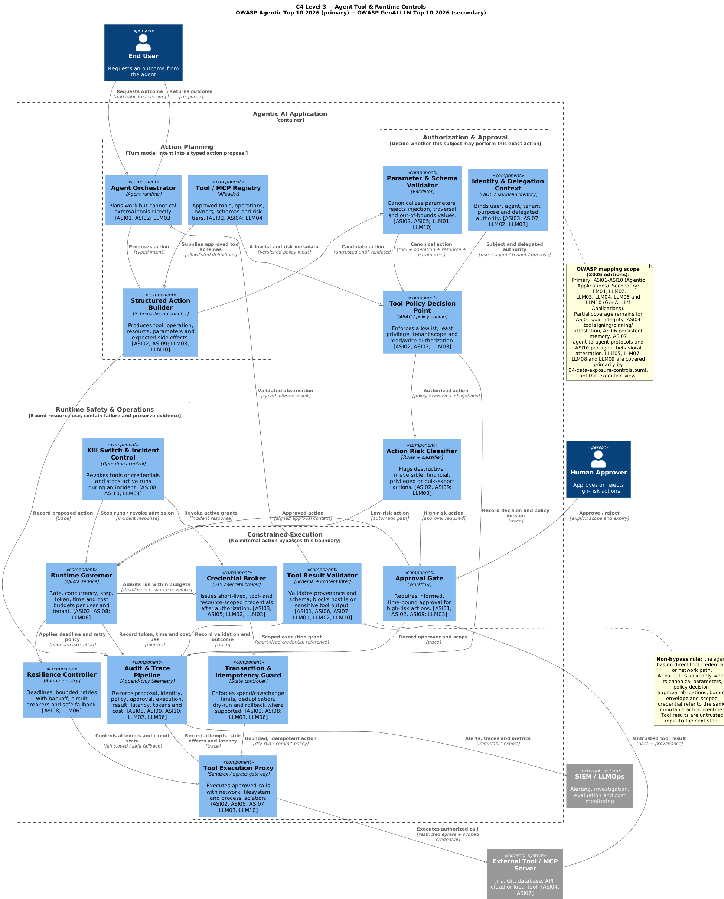

# Architecture — C4 Controls for Private-Data Exposure in AI Systems

This page explains the C4 model used in this repo and how the diagrams map onto the
private-data-exposure story told in [`article.md`](article.md). It covers the five
diagram views and the OWASP GenAI LLM Top 10 2026 coverage in
[`05-owasp-coverage.md`](05-owasp-coverage.md).

All diagrams are rendered with the native PlantUML binary (v1.2026.6, no JRE required)
from the `.puml` sources in this repo.

## What is C4 (and why here)

C4 (Context, Container, Component, Code) is a layered architecture-modeling notation.
The point is *progressive disclosure*: you show a system at increasing zoom so each
audience sees the right level of detail without drowning in the rest.

For LLM privacy, C4 is the right shape because "private data leaks in AI" is not one
risk with one control — it is several distinct surfaces (analyzers, tokenization and model diagnostics, semantic
search, RAG) plus supply-chain and post-usage concerns, each needing its own control.
The five views below walk from *who/what is involved* down to *which control sits where*.

| Level | Question it answers | Diagram |
|---|---|---|
| 1 — Context | Who uses the system and what external systems does it touch? | `01-context.png` |
| 2 — Container | What are the runtime building blocks and where do controls live? | `02-container.png` |
| 3 — Component | Which controls sit in which lifecycle stage? | `03-component.png` |
| 3 — Data-exposure | Private-data exposure across the four surfaces + supply chain + post-usage | `04-data-exposure-controls.png` |
| 3 — Agent tools/runtime | How are tool actions authorized, constrained, executed and observed? | `05-agent-tool-runtime-controls.png` |

## Level 1 — System Context

Establishes the actors (End User, AI Engineer, Compliance/Risk) and the external systems
(Model Provider, Enterprise Data, Regulator). Cross-cutting controls — governance, access
control, logging, vendor risk, compliance — apply at every level.


## Level 2 — Container

Where the controls physically live. The key containers are the **Guardrail/Policy Engine**
(input + output filtering, PII redaction, jailbreak/prompt-injection defense), the **LLM
Gateway** (key management, routing, metering), and the **Observability & Audit** store.


## Level 3 — Component (lifecycle stages)

Controls grouped by lifecycle stage:
- **Input:** AuthN/AuthZ, Input Sanitizer (prompt-injection defense), PII Redactor, Rate Limiter/Quota
- **Inference:** Orchestrator/prompt policy, Input Moderation, LLM Gateway
- **Output:** Output Moderation, Output Validator, PII Re-exposure Guard
- **Assurance/ops:** Audit Logger, Human-in-the-Loop, Eval & Drift Monitor, Policy/Config Store


## Level 3 — Data-exposure across surfaces (the core view)

This is the diagram the article is built around. It places private-data-exposure controls
across the four real surfaces plus the two layers most programs omit:

- **AI Analyzer / Cortex-style** — pre-redaction, field-level RBAC, ingested-content screening, output redaction
- **Tokenization & model diagnostics** — pre-scrub PII, restrict logprobs/internal states, rate-limit
- **Semantic Search** — encrypt embeddings, tenant ACLs, index validation
- **RAG** — doc-level pre-retrieval ACL, retrieved-content screening, post-retrieval PII redaction, output guardrail
- **Supply Chain & Vulnerability** — model/vendor inventory, SBOM scan, training-PII scan, provider config hygiene, provenance
- **Detection, Alerting & Feedback** — semantic egress DLP, embedding-exposure detector, anomaly detection, drift loop, audit→SIEM, red-team queue

Risk and control components are annotated with the applicable OWASP GenAI LLM Top 10
2026 categories (LLM01–LLM10).


## Level 3 — Agent tool and runtime controls

Agents can change external state, so text guardrails alone are not an authorization
boundary. This companion view makes every action pass through a non-bypassable path:

- **Action planning** — the model produces a typed proposal using an allowlisted tool/MCP registry; it has no direct tool credentials.
- **Authorization and approval** — canonical parameter validation precedes an identity- and resource-aware policy decision; destructive, financial, privileged and bulk-export actions require explicit human approval.
- **Constrained execution** — short-lived scoped credentials, transaction limits, idempotency, dry-run/rollback controls and an isolated tool proxy bound the action and its side effects.
- **Runtime safety** — rate, concurrency, step, token, time and cost budgets combine with deadlines, bounded retry/backoff, circuit breakers, safe fallback and an incident kill switch.
- **Evidence** — proposals, policy versions, approvals, attempts, side effects, results, latency, tokens and cost are exported through an append-only audit pipeline.

Tool results are treated as untrusted input before they can influence the agent's next
step. A shared immutable action identifier binds the proposal, decision, approval,
budget envelope and execution grant so none can be replayed for a different action.

Components are mapped primarily to the **OWASP Top 10 for Agentic Applications 2026**
(`ASI01`–`ASI10`) and secondarily to the applicable **OWASP GenAI LLM Top 10 2026**
categories. The diagram marks incomplete coverage explicitly: goal integrity, signed and
pinned tool provenance, persistent memory controls, agent-to-agent protocols and
per-agent behavioral attestation need additional components for full treatment.



## Visual summary (LinkedIn banner)

The banner reduces the architecture to four labeled, connected visual layers:

1. **Ingestion** — incoming data passes through a controlled entry point.
2. **Runtime / LLM** — the application processes data inside the model boundary.
3. **Supply chain** — linked models, providers, dependencies, and data sources form the
   delivery chain.
4. **Detection and feedback** — monitoring observes residual exposure and feeds findings
   back into the controls.

The single connecting line emphasizes that these are not isolated safeguards. A weakness
in an earlier layer propagates forward, while monitoring must feed improvements back into
ingestion and runtime controls. The labels identify the lifecycle stages, while the
minimal symbols keep the image suitable for an article banner; the C4 diagrams remain
the authoritative technical views.


## Diagram sources

The `.puml` files are the authoritative artifacts. They use the C4-PlantUML macros via
`!includeurl`, which the renderer fetches at build time. To re-render locally:

```bash
# native PlantUML binary (no JRE needed): https://github.com/plantuml/plantuml/releases
plantuml -tpng 01-context.puml 02-container.puml 03-component.puml 04-data-exposure-controls.puml 05-agent-tool-runtime-controls.puml
```

- [`01-context.puml`](01-context.puml) · [`01-context.png`](01-context.png)
- [`02-container.puml`](02-container.puml) · [`02-container.png`](02-container.png)
- [`03-component.puml`](03-component.puml) · [`03-component.png`](03-component.png)
- [`04-data-exposure-controls.puml`](04-data-exposure-controls.puml) · [`04-data-exposure-controls.png`](04-data-exposure-controls.png)
- [`05-agent-tool-runtime-controls.puml`](05-agent-tool-runtime-controls.puml) · [`05-agent-tool-runtime-controls.png`](05-agent-tool-runtime-controls.png)

## OWASP coverage

Every category of the **OWASP GenAI LLM Top 10 2026** is covered by at least one surface
in `04-data-exposure-controls.puml`. The category names and numbering come from the
[official OWASP project repository](https://github.com/owasp/www-project-top-10-for-large-language-model-applications)
and its linked [canonical 2026 source](https://github.com/GenAI-Security-Project/GenAI-LLM-Top10/tree/main/2026/final):

| OWASP 2026 | Risk | Covered by |
|---|---|---|
| LLM01 | Prompt Injection | analyzer, semantic search, RAG, red-team queue |
| LLM02 | Sensitive Information Disclosure | analyzer, diagnostics, semantic search, RAG, egress DLP |
| LLM03 | Excessive Agency | analyzer, semantic search, RAG |
| LLM04 | Supply Chain | vendor inventory, SBOM, training-PII scan, config, provenance |
| LLM05 | Data and Model Poisoning | semantic search, RAG, training-data scan |
| LLM06 | Unbounded Consumption | tokenization/model diagnostics, cross-surface anomaly detection |
| LLM07 | Misinformation | drift & feedback loop |
| LLM08 | Hidden Context Exposure | model diagnostics, RAG, provider config |
| LLM09 | Vector and Embedding Weaknesses | semantic search, RAG, embedding-exposure detector |
| LLM10 | Improper Output Handling | analyzer, RAG, SIEM alerting |

The agent tool/runtime view is mapped primarily to the separate [OWASP Top 10 for
Agentic Applications 2026](https://genai.owasp.org/resource/owasp-top-10-for-agentic-applications-for-2026/)
and secondarily to applicable LLM categories. It covers every `ASI` category, with
partial coverage explicitly identified rather than treated as complete mitigation.

See [`05-owasp-coverage.md`](05-owasp-coverage.md) for the per-surface notes and the
two coverage matrices, plus the "LLM as a new type of DLP" reframe.
