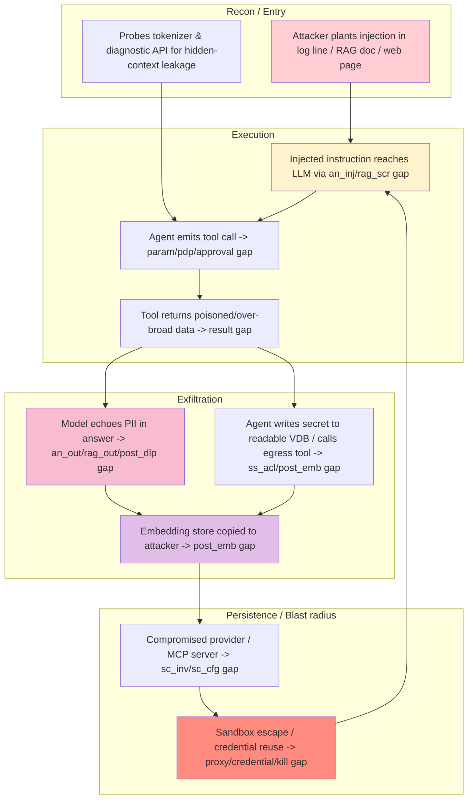
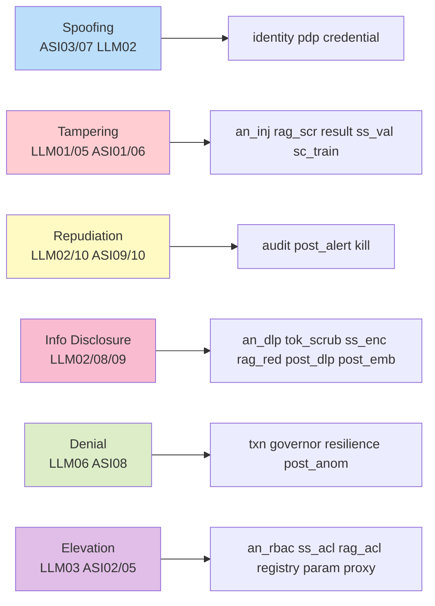
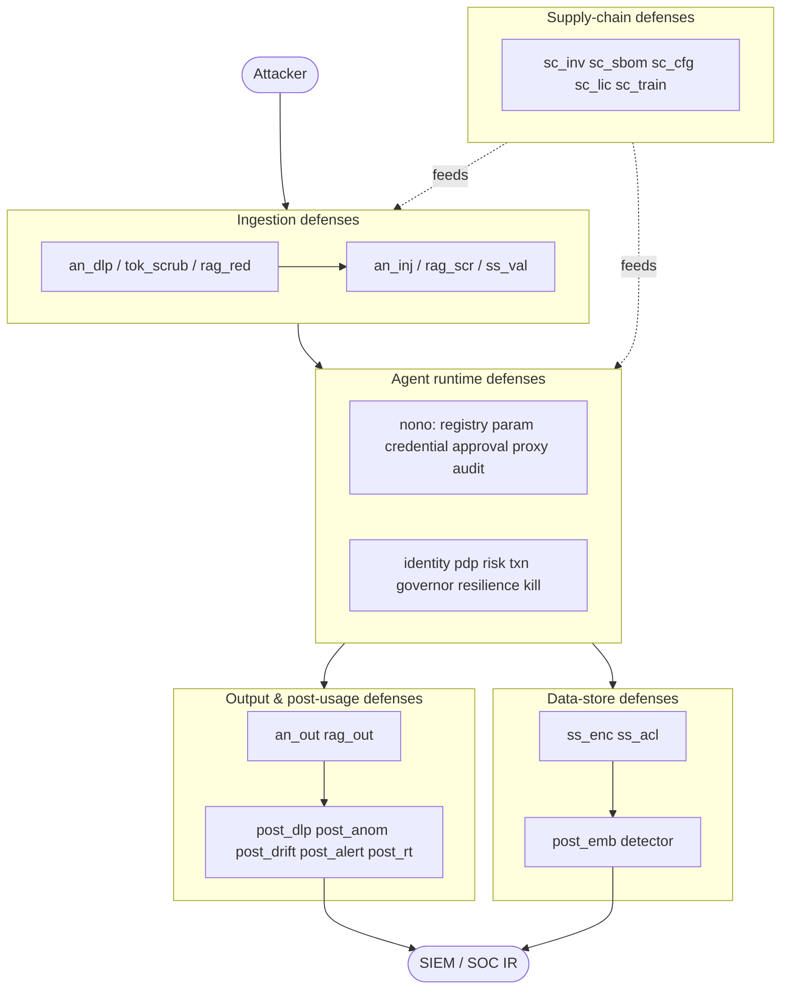

# Threat Analysis — LLM Private-Data Exposure & Agentic Controls

A detailed, attacker-objective-driven threat model for the 41 control components defined in this
repo (`04-data-exposure-controls.puml`, `05-agent-tool-runtime-controls.puml`). It is grounded in
the OWASP GenAI LLM Top 10 **2026** (`LLM01`–`LLM10`) and OWASP Agentic Top 10 **2026**
(`ASI01`–`ASI10`) mappings in [`owasp-coverage.md`](owasp-coverage.md).

> Companion to [`tool-candidates.md`](tool-candidates.md) (what implements each control) and
> [`oss-reference-architecture.md`](oss-reference-architecture.md) (a concrete OSS deployment).
> Validation: Mermaid blocks render under `@mermaid-js/mermaid-cli` v11.

## 1. Scope & threat actors

| Actor | Objective | Reach |
|---|---|---|
| **External attacker** | Exfiltrate PII/secrets via the model or tool calls; poison retrieval/training data | Prompts, tool outputs, RAG corpus, public model endpoints |
| **Malicious insider / compromised employee** | Bypass RBAC, use legit tooling for exfiltration | Internal logs, VDB, agent credentials |
| **Untrusted data source** | Indirect prompt injection, corpus/embedding poisoning | Logs, RAG docs, indexed web/code, training data |
| **Compromised dependency / provider** | Supply-chain pivot into the runtime | Tokenizer lib, embedding API, MCP server, model weights |
| **Abuse user** | Excessive agency, cost/denial, misinformation amplification | Agent loop, token budget |

## 2. Attack kill-chain (how a real exfil looks end-to-end)

A single leak rarely exploits one control. The dangerous paths chain surfaces.

**Key insight:** every red node has a *gap control* that, if missing or weak, lets the chain
continue. The model is never the only failure — it is a relay. Defense-in-depth means breaking the
chain at *multiple* hops, not hardening one.

## 3. Per-surface threat analysis

### 3.1 AI Analyzer / SIEM-SOAR summarization
- **Threat T-AN-1 (LLM01/LLM02):** log lines contain PII/credentials + hidden instructions; the
  summarizer both leaks the corpus and obeys the injection.
- **Controls:** `an_dlp` (scrub pre-egress), `an_rbac` (field-level), `an_inj` (injection screen),
  `an_out` (output redaction), then `post_dlp` re-verifies egress.
- **Weakness:** `an_inj` is classic-PII/DPI-focused; *semantic* injection in a log line is caught
  only by a separate-instance inspector (`post_dlp` pattern). Single LLM = self-blinded.

### 3.2 Tokenization & model diagnostics
- **Threat T-TOK-1 (LLM02/LLM08):** third-party tokenizer sees raw text; logprob/internal-state
  diagnostics reconstruct prompt or system instructions.
- **Threat T-TOK-2 (LLM06):** token-dense adversarial input drives cost/latency.
- **Controls:** `tok_scrub` (pre-scrub), `tok_gate` (restrict diagnostics to trusted ops),
  `tok_rl` (rate/token limit), `sc_sbom` (tokenizer lib CVE).
- **Weakness:** `tok_rl` via vLLM per-key logprob suppression is partial; `tok_gate` depends on the
  provider exposing a gating API.

### 3.3 Semantic Search / Vector DB
- **Threat T-SS-1 (LLM09/LLM02):** embedding inversion — Morris et al. recovered 92% of 32-token
  inputs; Cyborg reported 99.38% reconstruction against a production-like VDB. Treat embeddings as
  reversible.
- **Threat T-SS-2 (LLM03):** cross-tenant namespace access.
- **Threat T-SS-3 (LLM05):** index poisoning before ingest (`ss_val`).
- **Controls:** `ss_enc` (encrypt), `ss_acl` (per-tenant namespace), `ss_val` (pre-index screen),
  `post_emb` (**build** — flags a VDB copied/queried by an unexpected party).
- **Weakness:** `post_emb` has **no OSS tool** — only CSPM + VDB audit-log signal. This is the
  single most under-defended control against T-SS-1.

### 3.4 RAG
- **Threat T-RAG-1 (LLM01/LLM10):** indirect prompt injection via retrieved doc — the most-exploited
  RAG failure.
- **Threat T-RAG-2 (LLM02/LLM03):** over-broad retriever returns docs the user can't see; model
  faithfully includes PII.
- **Controls:** `rag_acl` (pre-retrieval ACL), `rag_scr` (retrieved-content screen), `rag_red`
  (post-retrieval redaction), `rag_out` (output guardrail), then `post_dlp` egress verify.
- **Weakness:** `rag_scr` is repurpose (NeMo rail) — partial semantic coverage; poisoned retrieval
  that *looks* benign still leaks via T-RAG-2.

### 3.5 Supply Chain
- **Threat T-SC-1 (LLM04):** unpinned/poisoned model, tokenizer lib CVE, malicious MCP server.
- **Threat T-SC-2 (LLM05):** poisoned fine-tune/corpus (`sc_train`).
- **Controls:** `sc_inv` (inventory), `sc_sbom` (CVE scan), `sc_cfg` (key hygiene, kill-switch),
  `sc_lic` (license/attestation), `sc_train` (Cleanlab — **adjacent only**).
- **Weakness:** `sc_train` poisoning has **no production tool**; `sc_inv`/`sc_cfg` are inventory +
  config only — signing, version pinning and attestation are gaps (ASI04 partial).

### 3.6 Post-Usage (the layer most programs skip)
- **Threat T-POST-1 (LLM02/LLM06):** leak that passed ingestion controls surfaces only in output
  volume / secret regex / token inflation.
- **Controls:** `post_dlp` (egress DLP), `post_anom` (anomaly), `post_drift` (eval/feedback),
  `post_alert` (SIEM), `post_rt` (red-team queue).
- **Weakness:** `post_emb` again; and `post_rt` depends on a human actually reviewing the queue.

### 3.7 Agent tool / runtime (`05`)
Full Agentic Top 10 2026 mapping:

| Threat | OWASP | Controls | Residual risk |
|---|---|---|---|
| Goal hijack | ASI01 | `agent`, `approval`, `result` | **No goal-integrity monitor** |
| Tool misuse | ASI02 | `registry`, `param`, `pdp`, `risk`, `approval`, `txn`, `proxy`, `governor` | Strong if nono-enforced |
| Identity/priv abuse | ASI03 | `identity`, `pdp`, `credential` | Strong |
| Agentic supply chain | ASI04 | `registry` | Partial — no signing/pinning |
| Unexpected code exec | ASI05 | `param`, `credential`, `proxy` | Strong (sandbox) |
| Memory/context poison | ASI06 | `result` | Partial — no persistent-memory model |
| Insecure inter-agent | ASI07 | `identity`, `proxy`, `result` | Partial — A2A protocols uncovered |
| Cascading failure | ASI08 | `txn`, `governor`, `resilience`, `audit`, `kill` | Strong |
| Human-agent trust exploit | ASI09 | `proposal`, `risk`, `approval`, `audit` | Approval fatigue (process) |
| Rogue agent | ASI10 | `audit`, `kill` | **No per-agent behavioral attestation** |

**Enforcement-spine threat:** if `nono` is absent, `registry`/`param`/`credential`/`approval`/
`proxy`/`audit` degrade to *app-enforced* checks the model can bypass. The model is not an
authorization boundary — without nono, every tool call trusts an untrusted planner.

## 4. STRIDE-style control coverage

## 5. Highest-impact gaps (prioritized)

| # | Gap | Enables | Severity |
|---|---|---|---|
| G1 | `post_emb` — no OSS embedding-exposure detector | T-SS-1 (inversion exfil) | **Critical** |
| G2 | `sc_train` — no production poisoning detector | T-SC-2 (poisoned model) | High |
| G3 | No goal-integrity monitor (ASI01) | goal hijack → rogue tool use | High |
| G4 | Agentic supply chain: no signing/pinning (ASI04) | malicious MCP server pivot | High |
| G5 | No persistent-memory poisoning model (ASI06) | memory-based injection persistence | Medium |
| G6 | No A2A protocol auth (ASI07) | agent-to-agent lateral movement | Medium |
| G7 | `post_rt` depends on human review | near-miss leaks go unexamined | Medium (process) |

## 6. Defense-in-depth topology (where each threat is caught)

## 7. Recommended remediation priority

1. **Close G1 (`post_emb`)** — build the embedding-exposure detector (VDB access-log anomaly +
   CSPM); until then, `ss_enc` + `ss_acl` are your only mitigation for T-SS-1.
2. **Enforce the spine with nono** — collapses G4-adjacent tool-execution risk and removes the
   "model is authz boundary" anti-pattern (ASI02/03/05).
3. **Separate-instance DLP** for `an_dlp`/`post_dlp` — never let the app LLM police itself.
4. **Sign + pin** every MCP server and model (`sc_inv`/`sc_cfg`) to start closing ASI04.
5. **Stand up `post_rt`** with a real human review SLA — a queue nobody reads is G7.
6. **Treat `sc_train` as build** — at minimum data-provenance attestation + Cleanlab pre-ingest.

## 8. What this analysis does NOT cover

- **LLM07 (Misinformation)** — governed by `post_drift`, not a per-request filter; acceptable?
- **User-facing incident comms** (DSAR / breach notification) — governance handoff, out of scope.
- **2023–24 OWASP numbering** — mappings above are 2026 edition; relabel if your audience expects
  the older scheme (2023–24 LLM06 = now LLM02, LLM08 = now LLM03).
