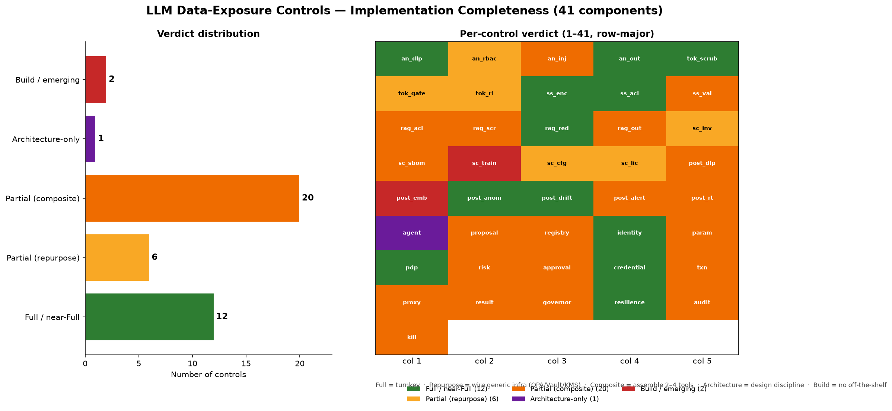

# Your LLM security stack has 41 controls. You can buy about 12 of them.

The "buy a guardrail product and you're covered" story doesn't survive contact with an actual architecture.

I took a C4 model of where private data *actually* leaks in AI systems — analyzers, tokenization, semantic search, RAG, supply chain, post-usage monitoring, and agent runtimes — and mapped all **41 distinct control components** to the real open-source and commercial tools that can implement each. Every control gets one honesty rating: turnkey, repurpose-some-infra, assemble-a-stack, architecture-only, or build-it-yourself.

The breakdown is uncomfortable for anyone selling "AI security in a box":

- **12 of 41** are turnkey or near-turnkey — PII redaction, vector-store tenant ACLs, embedding encryption, identity/ABAC, dynamic credentials, resilience, drift detection. Buy these.
- **6** are "repurpose generic infra" — you bolt OPA / Vault / KMS onto the data path yourself.
- **20** are composite — they exist only as a *stack* of 2–4 tools you assemble. No single product covers them.
- **1** (agent isolation) is an architecture discipline, not a feature.
- **2** are effectively build-don't-buy.

## The agent-execution loop is the clearest tell

There is **no product** that takes you from "the model proposes an action" to "a short-lived scoped credential is issued, the call runs in a sandbox, every step is immutably audited, and you can kill it mid-run" end to end. You assemble it from LangGraph/AutoGen + ToolHive + Vault + Temporal + HumanLayer + OpenTelemetry. The vendors waving "agent security" banners cover a slice, not the loop.

## The five controls you cannot buy

1. **Embedding-exposure detection** — no tool tells you a vector store was copied to, or queried from, an untrusted party. You build it (CSPM + VDB audit-log anomaly at best).
2. **Pre-train data-poisoning detection** — no production tool. Research-stage only.
3. **Agent isolation** — a design decision (planner emits, a separate hardened executor runs), not a framework toggle.
4. **Kill switch** — composed from Vault credential revoke + Kubernetes network policy + Temporal run cancel + framework stop. No product.
5. **Action risk classification** — mostly a custom LLM-judge plus OPA rules.

## The rule most teams miss

Your semantic DLP has to be a **separate model instance** from the app LLM — otherwise a compromised app model silently blinds its own DLP. SaaS DLP re-introduces the egress it's meant to police. The faithful implementation is self-hosted Presidio, open-weight Llama Guard, or Private AI.

## Bottom line

LLM data-security is a **build problem wearing a buy problem's clothes**. Spend the budget on the 12 you can buy. Staff the 23 you can't. The map says exactly where each dollar and each engineer should go.

Full 41-control matrix and per-control tooling: https://github.com/hoggmania/llm-c4-controls

#LLMsecurity #AISecurity #OWASP #GenAI #DataLeakage #AgenticAI #C4model #DLP
